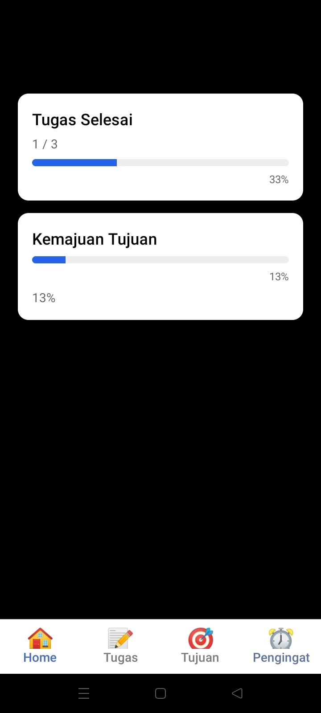
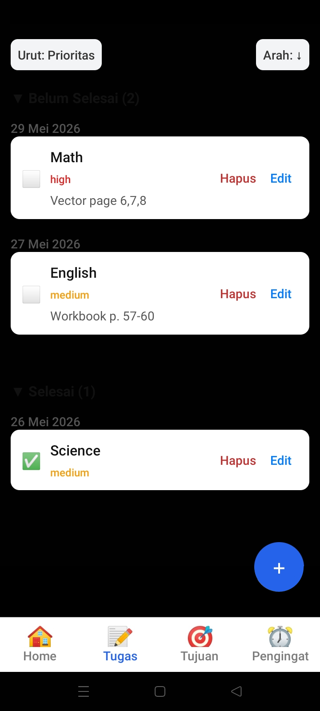
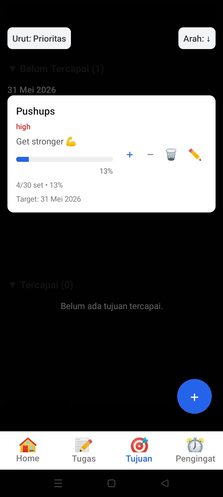
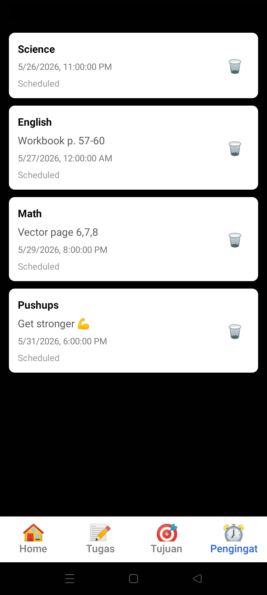

# SmartReminder
A simple mobile productivity app prototype to manage tasks, track goals, and set reminders. Built with React Native, Expo, and TypeScript.

## Background
SmartReminder was made for my high school's "Echo" technology exhibition (a Curriculum Merdeka P5 project, about innovation/creativity/tech). I was solely responsible for the entire development and making the whole app, and my teammates handled the booth setup and the pitch presentation.

Since I had decided to pick up React Native from scratch under a close deadline, I used an LLM to help with boilerplate and debugging. However, I made sure I actually understood what I was delivering: read unfamiliar code before using it, planned features in stages to ensure project stayed scoped and structured the project from the ground up so it stayed maintainable as it grew.

I wired AsyncStorage and Expo Notifications together so reminders fire at the right time based on stored task data, set up the folder structure early so debugging stayed manageable, and designed the UI to look minimalistic.

## Screenshots

| Home | Tasks | Goals | Reminders |
|---|---|----|---|
|  |  |  |  |

## No cloud data
(Since I'm planning to study cybersecurity) I thought about the data model early on. For a simple productivity app (small scope project), putting task data on the cloud means creating an account system, securing API endpoints, and trusting a third party with someone's daily habits (none of which the app actually needs). Keeping all data in the device local storage (via AsyncStorage) removes any exposure/risk.

## Tech stack
| | |
| --- | --- |
| Framework | React Native + Expo (tested on Expo Go) |
| Language | TypeScript |
| Navigation | Expo Router |
| Storage | AsyncStorage |
| Notifications | Expo Notifications |

## Project structure

```
app/
 ├── (tabs)/      # Tab navigation and main screens
 └── assets/      # Icons and images

src/
 ├── components/  # Reusable UI (cards, buttons, modals)
 ├── context/     # Global state management
 ├── models/      # TypeScript interfaces
 └── utils/       # Date helpers, storage, notification logic
```
